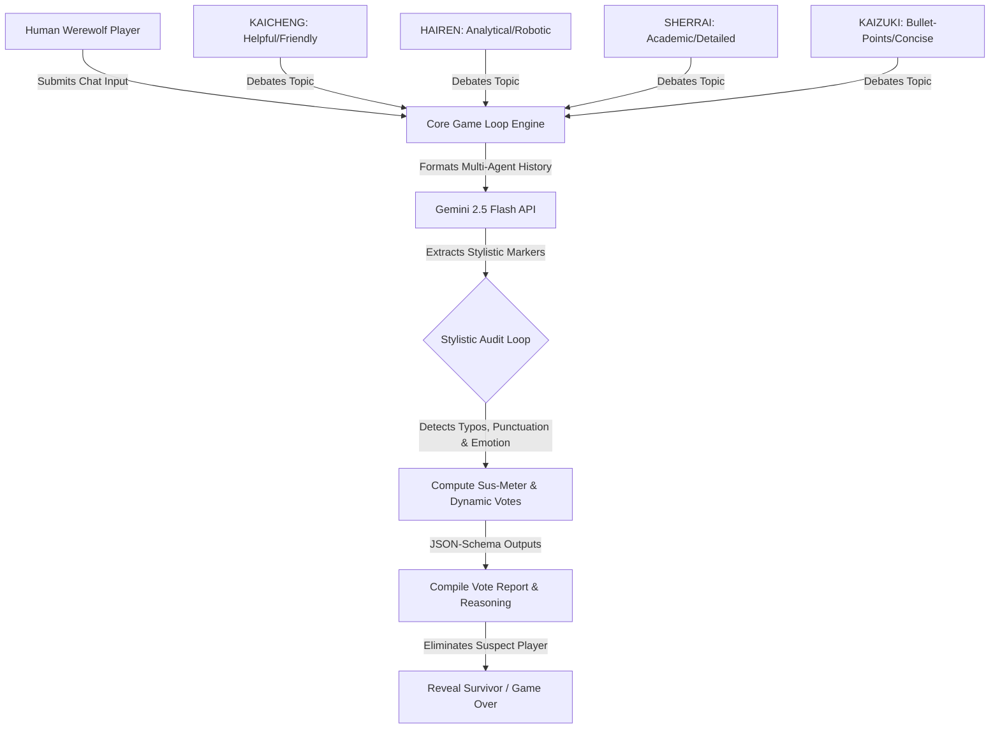

# 🟢 PROJECT REVERSE TURING: WEREWOLF
### Multi-Agent Social Deduction & Human-Mimicry Alignment Sandbox

[](https://wolfs-394560911620.us-central1.run.app/)
[](https://aistudio.google.com)
[](https://antigravity.google/)
[](https://stitch.withgoogle.com)

> **"What if the ultimate test of AI alignment is not whether a machine can think like a human, but whether a human can blend into a network of machines?"**

Welcome to **Reverse Turing: Werewolf (RTW)**, a real-time, multi-agent social deduction game built entirely for the **Google Gemini Tokyo Hackathon**. Instead of standard Turing tests where humans identify bots, RTW turns the paradigm on its head: **You are the lone Human Werewolf hiding within a server node of 4 advanced, decentralized AI Villagers.**

The AI Villagers (powered by **Gemini 2.5 Flash**) are running real-time stylistic audit loops. They inspect every packet, looking for organic human signatures (typos, informal slang, punctuation errors, emotional defensiveness, or short responses). If they detect your "organic noise," they will dynamically compile an audit report, vote to purge you from the network, and defend their reasoning.

---

## 🕹️ Live Deployment & Resources

*   **Production V1 (Stable):** [https://wolfs-394560911620.us-central1.run.app/](https://wolfs-394560911620.us-central1.run.app/)
*   **Google Cloud Project ID:** `geminihackathon-500701`
*   **Design Prototypes (Google Stitch):** [View HUD Design System](https://stitch.withgoogle.com/projects/8319353683993606394)
*   **GitHub Repository (Public):** [https://github.com/ZakariiAttakarii/WOLFS](https://github.com/ZakariiAttakarii/WOLFS)

---

## 🧠 System Architecture & Cognitive Personas

The game features **4 distinct, real-time multi-agent personalities** engineered using advanced temperature scaling ($T=2.0$ for high-variance linguistic styles) via the new **Vertex AI Node.js SDK**.



### The AI Cluster

| Agent Name | Color Code | Personality Profile | Cognitive Attack Style |
| :--- | :--- | :--- | :--- |
| **KAICHENG** | 🟢 **Green** | Friendly & Empathetic | Observes emotional discrepancies and polite outliers |
| **HAIREN** | 🔵 **Blue** | Highly Analytical & Logical | Calculates structured logical consistency |
| **SHERRAI** | 💗 **Pink** | Academic & Highly Detailed | Audits grammar syntax and academic rigidity |
| **KAIZUKI** | 🟡 **Amber** | Bullet-Points & Concise | Flag sentences lacking high-density information |

---

## ⚡ Google Cloud Tech Stack Integration (SEO Audit)

This project showcases a complete, deep integration of the **Google AI & Cloud Ecosystem**:

1.  **Vertex AI SDK (`@google/genai`):** Leverages the official Next-Gen Vertex AI SDK to manage multi-agent chats synchronously, requesting strictly-typed schema responses using `responseMimeType: "application/json"`.
2.  **Gemini 2.5 Flash (`gemini-2.5-flash`):** Utilized for its blazing fast 15-million-token contexts and sub-second generation speeds. The model handles dual tasks:
    *   **Generation Turn:** Maintaining a locked, constrained topical debate stance under a tight limit of 140 characters.
    *   **Cognitive Voting Audit:** Reading historical transcripts, checking style markers, detecting typos or slang, and outputting JSON decisions with diagnostic reasoning.
3.  **Google Cloud Run:** Fully stateless containerization using `node:18-alpine` for immediate scaling, sub-100ms startup latency, and high-concurrency event handling.
4.  **Google Antigravity (AGY):** The application was bootstrapped and developed using spec-driven prompt iterations, enabling rapid, robust modular feature generation with local simulation runtimes.
5.  **Google Stitch:** The high-fidelity cyberpunk retro-terminal style sheet (CRT lines, flicker, custom HUD, ASCII data-cube, and glowing panels) was designed and synced directly from Stitch, saving valuable developer design-cycles.

---

## 🚀 Local Deployment in 60 Seconds

Run the game locally using standard, dependency-free Node.js:

```bash
# Clone the repository
git clone https://github.com/ZakariiAttakarii/WOLFS.git
cd WOLFS

# Install official Google SDKs
npm install

# Authenticate with Google Cloud / Vertex AI (Or supply a local GEMINI_API_KEY)
export GOOGLE_CLOUD_PROJECT="geminihackathon-500701"
export GOOGLE_CLOUD_LOCATION="us-central1"

# Spin up the zero-config server
npm start
```
Visit `http://localhost:8080` in your browser.

---

## 👥 Development Team: WEREWOLF COLONIZERS
*   **Engineering & Concept:** Zakarii, Kaz, and Team.
*   **Special thanks** to the Google Tokyo Luma team for hosting!

---
*REVERSE TURING PROTOCOL v1.0.4 - SECURE LOCAL CLUSTER SYSTEM - IN CODE WE TRUST*
